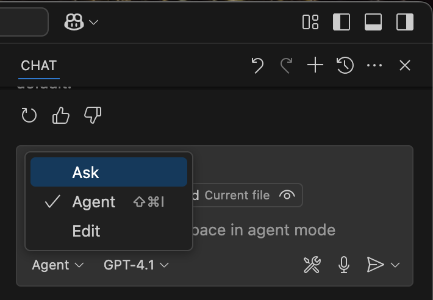

# github-mcp-server

This guide explains how to use `github-mcp-server` in VS Code, with Copilot as the MCP client, to create a GitHub repository.

## MCP Client
- **Copilot**

## Prerequisites
- VS Code version 1.99 or above
- Docker running

## github-mcp-server Documentation
For more detailed information, refer to the [github-mcp-server documentation](https://github.com/github/github-mcp-server).

## Steps to Run Local github MCP Server

- **Step 1: Add Github MCP server config in your VS Code settings**
    - Open VS Code.
    - Press `Ctrl+Shift+P`.
    - Select "Open User Settings (JSON)".
    - Paste the content of [github-mcp.json](./github-mcp.json) into your `settings.json` under the `mcp` key:
        ```json
        // ...existing code...
        "mcp": {
            // Paste the content of github-mcp.json here (remove the initial `{}` from the file)
        }
        ```
        **or**
    - Add [github-mcp.json](./github-mcp.json) as `.vscode/mcp.json` in your workspace.

- **Step 2: Run the server**
    - In VS Code, click `Run` below the `servers` section you just added.
    - You will be prompted for a GitHub Personal Access Token (PAT).
        > How to create a [GitHub Personal Access Token (PAT)](https://github.com/abcofdevops/github/blob/main/github-personal-access-token.md#how-to-create-a-pat)
    - Once the token is added, the server will start running.
        

- **Step 3: Use Copilot in Agent mode as MCP Client**
    - Open GitHub Copilot Chat.
    - Change the AI Assistant to Agent Mode.
        
    - Copilot is now in Agent mode.

- **Step 4: Create a repository on GitHub using Copilot as MCP-agent**
    - To create a repository, type the following command in Copilot chat:
        ```
        #create_repository <repo_name>
        create_repository mcp-project
        ```
        

> Locate   in Copilot options and this will show all the available tools provided by the MCP server.


